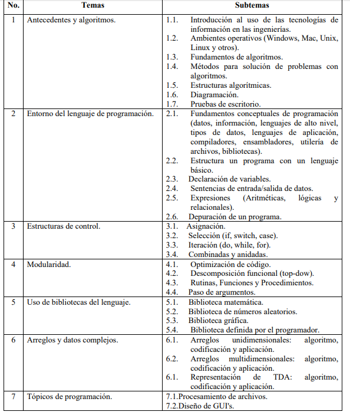

## Bienvenido al curso de Programación.

Esta asignatura aporta al perfil del Ingeniero Químico los elementos para formular, evaluar y resolver problemas involucrados en el desarrollo de proyectos relacionados con los procesos unitarios y de producción.

La programación es indispensable para reducir los tiempos empleados al evaluar problemas que requieren cálculos a detalle o ingeniería de detalle. Proporciona las herramientas necesarias para facilitar el manejo de datos y variables que requieren ser controladas en un sistema.

Esta asignatura aporta al perfil del Ingeniero Químico los elementos para formular, evaluar y resolver problemas involucrados en el desarrollo de proyectos relacionados con los procesos unitarios y de producción.

La programación es indispensable para reducir los tiempos empleados al evaluar problemas que requieren cálculos a detalle o ingeniería de detalle. Proporciona las herramientas necesarias para facilitar el manejo de datos y variables que requieren ser controladas en un sistema.

### Temario

[Temario oficial](http://itvillahermosa.edu.mx/docs/oferta/ingquimica/temario2010/1ERSEMESTRE/Programacion.pdf).

### Plataformas de trabajo diario

Plataforma oficial cuantitativa en [Google Classroom](https://classroom.google.com).
Depósito de Código Fuente en http://github.com para los diversos lenguajes de programación, CSharp, Java, Python

### Materiales
Las unidades de esfuerzo academico, se esta considerando una estudiante sin computadora que acude a Centro de Computo a sala de consulta de 7am a 10pm de Lunes a Viernes.

1. Internet basico de 1 mb minimo (aplica celular 3G)  disponible las 15 hrs del dia.

2. Prestamo de 1 USB en el bloque 2 para correo el Sistema Operativo Linux, este será formateado, ligero uso de 10 dias a finales de Febrero.

3. Cuenta institucional @tectijuana.edu.mx

4. Smarthphone Android con Wifi o Iphone 5S minimo disponible en algun momento para sus pruebas
